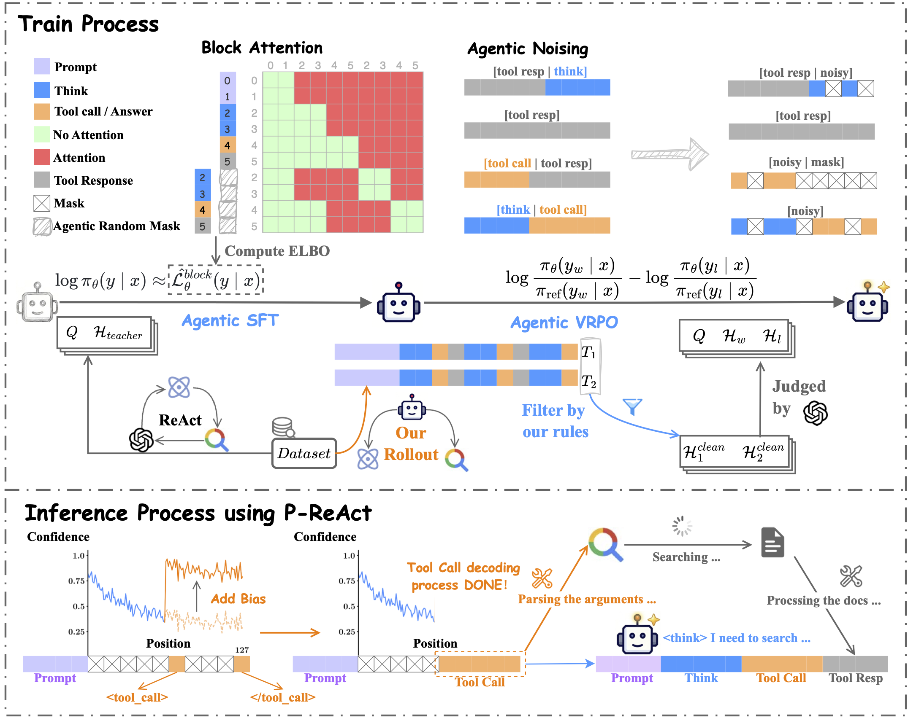

  <h1 align="center" style="margin-top: -50px;">🚀 DLLM-Searcher </h1>

  <h5 align="center"> If you like our project, please give us a star ⭐ on GitHub for the latest update.</h5>


> [!NOTE]
> This project includes the codebase, datasets for dLLM post-training: **Agentic SFT** and **Agentic VRPO**.
>
> Also includes the implementation of P-ReAct, adapted from [SDAR](https://github.com/JetAstra/SDAR)'s jetengine.
## ⚡One P-ReAct Iteration

DLLM-Searcher decodes the tool call region before think region，so DLLM-Searcher always **keeps thinking while waiting** for tool response.

  <div align="center">    </div>

## 📋 Overview

We design a two-stage post-training pipeline encompassing **Agentic SFT** and **Agentic VRPO** to enhance the reasoning and tool-calling capabilities. Furthermore, we propose a novel agent paradigm termed **P-ReAct**. P-ReAct guides the model to prioritize decoding **tool_call** instructions, thereby allowing the model to **keep thinking while waiting** for the tool's return.  

<!-- Uncomment this line if you have an intro image --> <!-- <div align="center">   </div> --> <div align="center">   </div>


------

  ## 📁 Project Structure

  In this project, we organized the code as follows:

  ```text
  .
  ├── Dataroller/              # 📊 Data collection and preparation
  │   ├── scripts/     
  │   │   └── test.sh          # Run for data collecting
  │   ├── prompt.py                              
  │   ├── react_agent.py       # ReAct agent implementation
  │   ├── run.sh               
  │   ├── run_multi_react.py   # Multi-turn ReAct execution
  │   └── tool_search.py       # Search tool definitions
  │
  ├── dLLM_trainer/            # 🔧 Training pipelines
  │   ├── SFT/                 
  │   │   └── dLLM-RL/           
  │   │       ├── train/       # SFT training code
  │   │       ├── data/        # SFT datasets
  │   │       └── sdar_sft.sh  # SFT training script  
  │   │
  │   └── VRPO/                
  │       ├── my_train/        # VRPO training code
  │       │   └── jetengine/   
  │       └── recipes/         # VRPO training configurations
  │
  ├── my_eval/                 # 🚀 Evaluation scripts
  │
  └── visualization/           # 🎨 Visual assets
      ├── main.png
      └── diffusion_generation.gif
  ```

------

  ## 🛠️ Installation

  We recommend using **separate environments** for data collection, Agentic SFT training, Agentic VRPO training, and inference to avoid dependency conflicts.

  ### 📦 Data Collection Environment

  ```bash
  conda create -n dllmeval python=3.10
  conda activate dllmeval
  pip install torch==2.8
  wget https://github.com/mjun0812/flash-attention-prebuild-wheels/releases/download/v0.3.18/flash_attn-2.7.4+cu128torch2.8-cp310-cp310-linux_x86_64.whl
  pip install flash_attn-2.7.4+cu128torch2.8-cp310-cp310-linux_x86_64.whl
  pip install sglang[all]
  pip install qwen-agent[gui,rag,code_interpreter,mcp]
  ```

  ### 🎯 SFT Training Environment

  ```bash
  conda create --name dllm-rl python=3.10
  conda activate dllm-rl
  pip install torch==2.6.0
  pip install --no-cache-dir \
    https://github.com/Dao-AILab/flash-attention/releases/download/v2.7.4.post1/\
  flash_attn-2.7.4.post1+cu12torch2.6cxx11abiFALSE-cp310-cp310-linux_x86_64.whl
  cd dLLM_trainer/SFT/dLLM-RL
  pip install -r requirements.txt
  ```

  ### 🎓 VRPO Training Environment

  ```bash
  conda create -n espo python=3.11 -y
  conda activate espo
  pip install torch==2.6.0
  pip install --no-cache-dir \
    https://github.com/Dao-AILab/flash-attention/releases/download/v2.7.4.post1/\
  flash_attn-2.7.4.post1+cu12torch2.6cxx11abiFALSE-cp310-cp310-linux_x86_64.whl
  cd dLLM_trainer/VRPO
  pip install -e ".[code]"
  pip install wandb==0.15.12 protobuf==3.20.3
  ```

### 🚀 Inference Environment

  ```bash
  # The Same as VRPO
  ```

------

  ## 📊 Data Preparation

  We use the `Dataroller` module to collect and process training data using the following command:

  ```bash
  cd Dataroller
  bash scripts/test.sh
  ```

  We release our SFT dataset in `dLLM_trainer/SFT/data/data.json` and our VRPO dataset in `dLLM_trainer/VRPO/data/train.jsonl`

  **Dataset Structure:**

  - Includes reasoning traces, tool calls, and search results

------

## 🎯 Agentic SFT Training

  ### Configuration

  Before starting SFT training, you should configure the paths in `sdar.yaml` and `sft_sdar.py`:

  **sdar.yaml:**

  ```yaml
  model:
      pretrained_model: "your_path"  # Absolute path to your pretrained model
      optimized_name: "optimized"    # Output name for optimized model, saved under sft_sdar/ckpt
  ```

  **sft_sdar.py:**

  ```python
  with open("../data/" + config.dataset.optimization_data + ".json", 'r') as f:
      dataset_load = json.load(f)
  ```

  ### Training

  After configuration, launch the SFT training as follows:

  ```bash
  cd dLLM_trainer/SFT/dLLM-RL
  bash sdar_sft.sh
  ```

------

## 🎓 Agentic VRPO Training

  ### Configuration

  Update the path configurations in `dpo.yaml` according to your setup:

  ```yaml
  # Example configuration structure
  model:
      path: "your_sft_model_path"  # Path to SFT trained model
  # Additional VRPO-specific configurations
  ```

  ### Training

  Launch the VRPO training as follows:

  ```bash
  cd dLLM_trainer/VRPO
  bash run_dpo.sh
  ```

------

## 🚀 Inference with P-ReAct

  Only 11 lines of code to implement complete token-prefilling and confidence biasing .

```python
# dLLM_trainer/VRPO/my_train/jetengine/engine/scheduler.py
elif 'toolcall_pre_rl' in seq.remasking_strategy:
    if seq.current_denoising_step == 0:
        seq_x0[your_tool_end] = 151658 # </tool_call>
        transfer_index[your_tool_end] = True
        seq_x0[your_tool_start] = 151657 # <tool_call>
        transfer_index[your_tool_start] = True
    else:
        confidence = torch.where(mask_index, seq_x0_p, -np.inf)
        confidence[your_tool_start:your_tool_end + 1] = confidence[your_tool_start:your_tool_end + 1] + 0.5
        _, top_indices = torch.topk(confidence, num_to_transfer)
        transfer_index[top_indices] = True
```

### Features

  - ⚡ Parallel reasoning and action execution
  - 🔄 Asynchronous tool calling
  - 📈 Reduced end-to-end latency
  - 🎯 Improved search agent efficiency

------

## 📊 Evaluation

  Use the trained model to roll out the data script as follows :
  ```bash
  cd inference/my_eval
  bash run_test.sh
  ```

 The LLM as judge prompt we use is

```python
    prompt = '''Given a Question and its Golden Answer, verify whether the Predicted Answer is correct. 
    The prediction is correct if it fully aligns with the meaning and key information of the Golden Answer. 
    Respond with ONLY True if the prediction is correct and ONLY False otherwise.
    Question: {question}
    Golden Answer: {reference}
    Predicted Answer: {prediction}
    '''
```

  Evaluation scripts are available in the `inference/my_eval/` directory. 

  ```bash
  cd inference/my_eval
  python cal_acc.py
  ```

------

  ## 🙏 Acknowledgements

  We sincerely thank the authors of the following open-source repositories for their efforts:

  - **Training Frameworks**: [TraceRL](https://github.com/Gen-Verse/dLLM-RL/tree/main), [ESPO](https://github.com/ML-GSAI/ESPO)
  - **Evaluation & Serving**: [WebSailor](https://github.com/abusallam/Websailor), [R1Searcher](https://github.com/RUCAIBox/R1-Searcher)
  - **Base Models**: [LLaDA](https://github.com/ML-GSAI/LLaDA), [Dream7B](https://github.com/DreamLM/Dream), [SDAR](https://github.com/JetAstra/SDAR)

------

