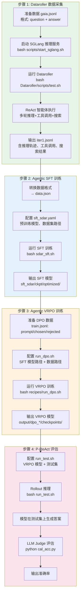
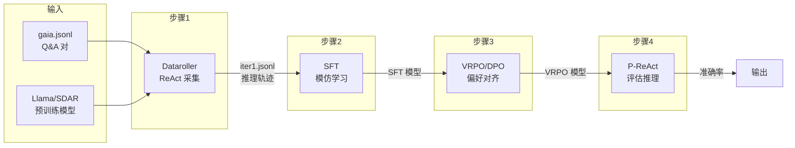

# DLLM-Searcher 四步工作流程详解

本文档详细说明 DLLM-Searcher 项目的完整流程，包括数据采集、SFT 训练、VRPO 训练和 P-ReAct 评估四个步骤。

---

## 整体流程图



---

## 数据流与模型演进



---

## 四步详细说明

### 步骤 1：Dataroller 数据采集（dllmsearch 环境）

**目的**：用 ReAct 智能体在问答数据上跑推理，采集「问题 → 推理轨迹 → 工具调用 → 搜索 → 答案」的完整 trace，作为后续 SFT/VRPO 的训练数据。

**在做什么**：
1. **启动 SGLang**：`scripts/start_sglang.sh` 启动一个 LLM 推理服务（默认 Llama-3.1-8B），供 Dataroller 调用。
2. **运行 Dataroller**：`Dataroller/scripts/test.sh` 读取 `Dataroller/data/gaia.jsonl`（或 example.jsonl），对每个问题调用 ReAct 智能体。
3. **ReAct 执行**：`run_multi_react.py` + `react_agent.py` 实现多轮「思考 → 调用工具（如搜索）→ 观察结果 → 再思考」的循环，直到给出最终答案。
4. **输出**：`Dataroller/base/<model>_sglang/gaia/iter1.jsonl`，每行是一条完整的推理轨迹（含 prompt、response、step_map 等）。

**关键脚本**：
- `scripts/start_sglang.sh`：启动 SGLang 服务
- `Dataroller/scripts/test.sh`：主入口，循环调用 `run.sh`
- `Dataroller/run_multi_react.py`：多线程 ReAct 执行
- `Dataroller/react_agent.py`：ReAct 智能体逻辑

---

### 步骤 2：Agentic SFT 训练（dllm-rl 环境）

**目的**：用步骤 1 采集的推理轨迹做监督微调，让模型学会「在思考的同时调用工具」的 Agentic 行为。

**在做什么**：
1. **数据准备**：将 Dataroller 输出转换为 SFT 格式（`prompt`、`response`、可选 `step_map`），或直接使用官方 `dLLM_trainer/SFT/data/data.json`。
2. **配置**：在 `configs/sft_sdar.yaml` 中设置：
   - `model.pretrained_model`：预训练基础模型（如 SDAR-1.7B、Llama-3.1-8B）
   - `model.optimized_name`：输出名
   - `dataset.optimization_data`：数据集名（对应 `../data/<name>.json`）
3. **训练**：`sdar_sft.sh` 启动 8 GPU 分布式训练（DeepSpeed ZeRO-3），使用 semi-ar 或 trace 方法。
4. **输出**：`sft_sdar/ckpt/optimized/`，得到具备 Agentic 推理能力的 SFT 模型。

**关键脚本**：
- `dLLM_trainer/SFT/dLLM-RL/sdar_sft.sh`：训练入口
- `dLLM_trainer/SFT/dLLM-RL/train/sft_sdar.py`：SFT 训练逻辑
- `dLLM_trainer/SFT/dLLM-RL/configs/sft_sdar.yaml`：配置文件

---

### 步骤 3：Agentic VRPO 训练（espo 环境）

**目的**：在 SFT 模型基础上做偏好优化（DPO/VRPO），让模型更偏好「好的推理轨迹」而非「差的推理轨迹」，提升答案质量。

**在做什么**：
1. **数据准备**：`data/train.jsonl`，每行格式为 `prompt`、`chosen`（好轨迹）、`rejected`（差轨迹）。可用官方示例或从 Dataroller 输出构造。
2. **配置**：在 `recipes/run_dpo.sh` 中设置：
   - `model_name_or_path`：步骤 2 的 SFT 模型路径
   - `dataset_path`：VRPO 训练数据路径
3. **训练**：`recipes/run_dpo.sh` 启动 8 GPU 的 DPO 训练，使用 ESPO 框架。
4. **输出**：`output/dpo_*/checkpoints/`，得到偏好对齐后的 VRPO 模型。

**关键脚本**：
- `dLLM_trainer/VRPO/recipes/run_dpo.sh`：训练入口
- `dLLM_trainer/VRPO/my_train/my_dpo_train.py`：DPO 训练逻辑
- `dLLM_trainer/VRPO/recipes/dpo.yaml`：配置文件

---

### 步骤 4：P-ReAct 评估

**目的**：用训练好的 P-ReAct 模型在测试集上做 rollout，并用 LLM Judge 计算准确率。

**在做什么**：
1. **Rollout 推理**：修改 `my_eval/run_test.sh` 中的 `MODEL_PATH`（VRPO 模型）、`BASE_DATA_DIR`（测试集目录）、`BASE_OUTPUT_DIR`（输出目录）、`DATASETS`（如 hotpotqa、gaia）。脚本调用 `my_train/my_test.py` 在测试集上生成预测。
2. **LLM Judge**：修改 `my_eval/cal_acc.py` 中的 `data_path` 指向 rollout 输出，并配置 `config.json` 中的 `judge_api_key`、`judge_api_base`、`judge_model`。脚本用 LLM 判断「预测答案」是否与「标准答案」语义一致。
3. **输出**：准确率统计（True/False 比例）。

**关键脚本**：
- `my_eval/run_test.sh`：Rollout 入口
- `dLLM_trainer/VRPO/my_train/my_test.py`：P-ReAct 推理逻辑
- `my_eval/cal_acc.py`：LLM Judge 评估

---

## P-ReAct 核心特性

P-ReAct 是 DLLM-Searcher 提出的智能体范式，核心思想是：

- **优先解码 tool_call**：在思维区域之前先解码工具调用区域。
- **持续思考**：在等待工具返回时，模型可以持续进行推理，而不是空等。
- **并行推理与动作执行**：降低端到端延迟，提升搜索智能体效率。

---

## 环境与依赖一览

| 步骤 | 环境名 | 主要依赖 |
|------|--------|----------|
| 1 | dllmeval | SGLang, qwen-agent, torch |
| 2 | dllm-rl | TraceRL, DeepSpeed, SDAR |
| 3 | espo | ESPO, wandb |
| 4 | espo | 与步骤 3 相同 |

---

## 快速命令速查

```bash
# 步骤 1
bash scripts/start_sglang.sh
bash Dataroller/scripts/test.sh

# 步骤 2
cd dLLM_trainer/SFT/dLLM-RL && bash sdar_sft.sh

# 步骤 3
cd dLLM_trainer/VRPO && bash recipes/run_dpo.sh

# 步骤 4
cd dLLM_trainer/VRPO && bash ../my_eval/run_test.sh
cd my_eval && python cal_acc.py
```
